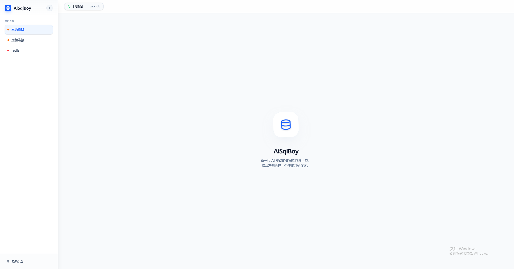

# AiSqlBoy

AiSqlBoy 是一款集成 AI 能力的现代化数据库管理工具，旨在通过人工智能简化 SQL 编写、调试和数据库管理流程。

## 🚀 功能特性

- **🤖 AI 智能辅助**：
  - **自然语言转 SQL**：通过对话直接生成复杂的 SQL 查询。
  - **智能修改**：选中 SQL 代码，通过 AI 指令快速优化或调整逻辑。
  - **上下文感知**：AI 自动读取当前数据库/表的 Schema（结构），拒绝幻觉，生成准确代码。
- **📊 多数据库支持**：支持 MySQL, PostgreSQL, SQLite 和 Redis。
- **🛠️ 控制台管理**：
  - 支持多标签控制台。
  - 控制台可针对特定表创建，自动关联表结构上下文。
  - 支持 SQL 自动补全和语法高亮。
- **📁 数据管理**：可视化浏览表数据、修改结构、管理索引。
- **🔄 自动更新**：内置自动更新机制，确保始终使用最新版本。
- **📦 自动化发布**：集成 GitHub Actions，支持通过 Git Tag 自动打包发布 Windows 安装包。

## 🛠️ 技术栈

- **Frontend**: React 19, Tailwind CSS 4, Framer Motion
- **Backend**: Electron 33, Node.js
- **Build Tool**: Vite 7
- **Database Drivers**: mysql2, pg, sqlite3, redis
- **AI Integration**: DeepSeek API (支持自定义 API Key)

## 📦 安装与开发

### 环境要求
- Node.js 20+
- npm 或 yarn

### 开发环境启动
```bash
# 安装依赖
npm install

# 启动开发服务器
npm run dev
```

### 打包发布
项目已配置 GitHub Actions 自动发布。手动打包命令：
```bash
# 生成安装包
npm run build

# 打包并尝试发布 (需要 GITHUB_TOKEN)
npm run publish
```

## 📝 使用说明

1. **连接数据库**：在侧边栏点击“+”添加您的数据库连接。
2. **AI 配置**：在设置界面填入您的 DeepSeek API Key 即可开启 AI 辅助功能。
3. **创建控制台**：右键点击数据库或特定表，选择“新建查询控制台”。
4. **发布新版本**：
   - 提交代码后打上标签：`git tag v1.x.x`
   - 推送标签：`git push origin v1.x.x`
   - GitHub Actions 将自动处理后续打包。

## 📄 开源协议
ISC License
